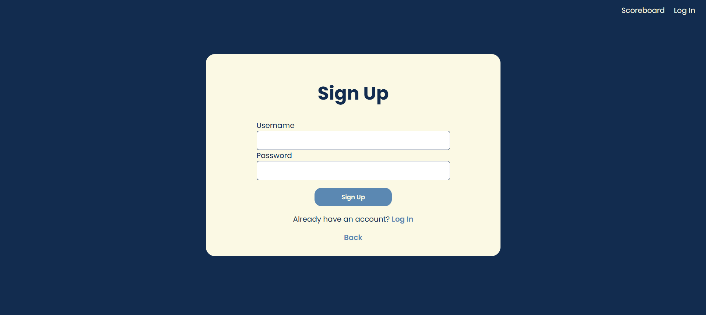

# Memory Game 🧠
This is an interactive web game where players test their memory by matching pairs of cards. Users can sign up or log in to track their scores and compete on the global scoreboard.
Built with **Node.js, HTML, CSS, JavaScript, and EJS**, this project combines classic gameplay with user authentication and score tracking.

### Features
- User authentification
- Classic memory game logic
- Saving and upodating score

### File setup
I set up the project using Node.js, starting by installing the necessary modules: Express, express-session, nodemon, bcrypt, mysql2, EJS, and dotenv. I used EJS as the templating engine and placed all my .ejs files in a folder called "views". Static files like CSS and JavaScript are served from the "public" folder. I created a basic HTML structure for all my EJS templates and added simple GET routes to render each page.

### Styling
Though visual appearance and design weren't my main priority, I decided to style my project in a coherent theme. The illustrations on the cards are from https://www.vecteezy.com/vector-art/21847416-vector-marine-life-illustration-set-isolated-on-a-white-background The color palette is from Pinterest and the font is "Poppins" from Google Fonts.

### User authentification
For this project, I kept the user authentification simple - the players only need an unique username and a password, which are saved to the database via the POST */signup* route, and checked via the POST */login* route. The passwords are encrypted with *bcrypt*.

### Game Logic
The entire game logic is written in the script.js file. The cards are created using the *createCard()* function and they get assigned a random value (a random image) in the *generateCards()* function. This is achieved by storing the image paths in an array, shuffling it, and then distributing the images across the cards.
The main logic is in the *handleCardClick()* and *checkCards()* functions, which make sure only two cards are flipped at a time and compare their values - if they match, the cards 'disappear', otherwise they flip back. 
The function *checkGameEnd()* checks if all the cards have been matched and displays the final message: the number of attempts, time taken and of course, the score.

### Scoreboard
The player's score is saved to the database through a POST request to the */savescore* route, which is triggered by the asynchronous *saveScore(score)* function in script.js. A simple SQL SELECT query retrieves the player's current high score and compares it to the new score—if the new score is higher, the database is updated accordingly.
The *user* table also stores the date when the player achieved their high score, as well as the date they last played. Both of these values are updated via the same /savescore route.
The scoreboard, rendered in *scoreboard.ejs*, displays the top five players from the user table (excluding any sensitive data like passwords), ranked by their High_score.
